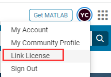
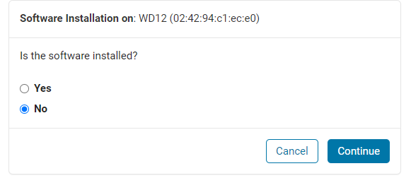

**os**：Linux

**安装**：matlab2015a

**权限情况**：部分需要root权限

**步骤**：

1. 下载

   ```bash
   wget http://mirror.seu.edu.cn/matlab/R2015a/R2015a-glnxa64.iso
   ```

2. 解压：

   1. 用7z无权限解压缩iso文件

      1. 安装7z：

         ```bash
         wget http://nchc.dl.sourceforge.net/project/p7zip/p7zip/9.20.1/p7zip_9.20.1_src_all.tar.bz2
         tar -jxvf p7zip_9.20.1_src_all.tar.bz2
         cd p7zip_9.20.1
         make
         make intall
         ```

      2. 解压

         ```bash
         7z x [文件] -r -o[目标目录]
         ```

         - x 代表解压缩文件，并且是按原始目录解压（还有个参数 e 也是解压缩文件，但其会将所有文件都解压到根下，而不是自己原有的文件夹下）manager.7z 是压缩文件，这里大家要换成自己的。如果不在当前目录下要带上完整的目录
         - -r 表示递归所有的子文件夹
         - -o 是指定解压到的目录，这里大家要注意**-o后是没有空格的直接接目录** 

   2. 有权限就用mount

      ```bash
      mount [文件] [目标目录] -o loop
      ```

3. 静默安装
   安装的服务器没有图形化界面，只能在安装前配置好激活文件等等

   1. 关联许可证

      

      这里需要提前用教育邮箱注册账号；
      “**License Number\* or Activation Key**” 填 $12233-94207-95786-13322-10810$（出处：学校软件正版化安装手册）

   2. 获取FIK和lic文件

      1. 在填完激活证密钥之后依次选择：$\text{Licences} \rightarrow \text{激活证} \rightarrow \text{Install and Activate} \rightarrow \text{Activate to Retrieve License File} \rightarrow \text{Activate a Computer} $

      2. 依次填写安装的版本和主机信息

         

         - **Host ID：**命令行输入`/sbin/ifconfig`查看，ID格式是`xx:xx:xx:xx:xx:xx`（使用指令看到很多ID，但是博主也不清楚应该选哪个，看其他教程结论是一般选`eno1`或者`eno2`，但是我在另一台服务器上安装时没有`eno1`和`eno2`）
         - **Computer Login Name：**命令行输入`hostname`查询
         - **Activation Label：**自定

      3. 选择“未安装”

         

      4. 下载License文件，保存File Installation Key

   3. 在iso文件解压文件夹中配置installer_input和active.ini

      1. installer_input：
         - destinationFolder：安装文件夹
         - fileInstallationKey：FIK
         - outputFile：自定
         - mode：填"silent"
         - licensePath：lic文件地址
      2. activate.ini：
         - `isSilent=true`
         - `activateCommand=activateOffline `
         - `licenseFile=[lic文件地址]`

   4. 在iso解压文件夹下执行

      ```bash
      sudo ./install --inputFile installer input.txt
      ```

      